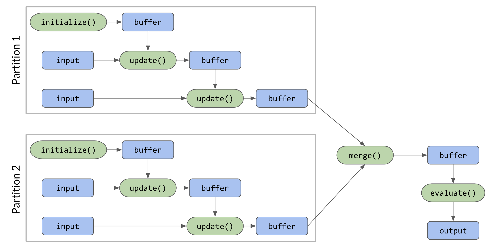

# XKE UDAF

## Les UDAFs en Spark

Les UserDefinedAggregateFunctions permettent d'implémenter vos propres fonctions d'agrégation. Elles n'existent que dans les APIs Java et Scala.

#### L'implémentation
Pour définir une UDAF vous devez créer une classe qui étend la classe abstraite `UserDefinedAggregateFunction` du package `org.apache.spark.sql.expressions`. Elle implémente 8 méthodes : 
 - `inputSchema` : Schéma des données d'entrées
 - `bufferSchema` : Schéma des données intermédiaires
 - `dataType` : Type des données de sorties
 - `deterministic` : Booléen à `true` si les données de sortie sont toujours les mêmes pour un dataset donné
 - `initialize` : Initialisation des buffers d'agrégation
 - `update` : Mise à jour des buffers d'agrégation
 - `merge` : Merge des buffers d'agrégation
 - `evaluate` : Génération du résultat final
 
#### Illustration

## Les exercices

Les exercices sont dans le package `fr.xebia.udaf`. Il y a ensuite un package par exercice. Pour chaque UDAF les 8 méthodes sont pré-écrites. Vous n'avez plus qu'à les implémenter. Les solutions se trouvent sur la branche `solution`.

#### Exemple - Moyenne
Dans le package `example` vous avez un exemple de l'implémentation du calcul d'une moyenne avec une UDAF. 

#### Exercice 1 - Maximum
Implémentez une UDAF qui calcule le maximum d'une colonne.

#### Exercice 2 - Moyenne Géométrique
Implémentez une UDAF qui calcule la moyenne géométrique d'une colonne. Pour une série `x1, ... , xn` de nombres, la moyenne géométrique se calcul de la façon suivante :  
 

#### Exercice 3 - Ecart type
Implémentez une UDAF qui calcule l'écart type d'une colonne. Pour une série `x1, ... , xn` de nombres, l'écart type se calcul de la façon suivante :  
 

Où *&mu;* est la moyenne de la série

#### Bonus 1 - Skewness
Implémentez une UDAF qui calcule le skewness (l'asymétrie) d'une colonne. Pour une série `x1, ... , xn` de nombres, le skewness se calcul de la façon suivante :  
 

Où *&mu;* est la moyenne de la série

#### Bonus 2 - Kurtosis
Implémentez une UDAF qui calcule le kurtosis (l'aplatissement) d'une colonne. Pour une série `x1, ... , xn` de nombres, le kurtosis se calcul de la façon suivante :  
 

Où *&mu;* est la moyenne de la série
